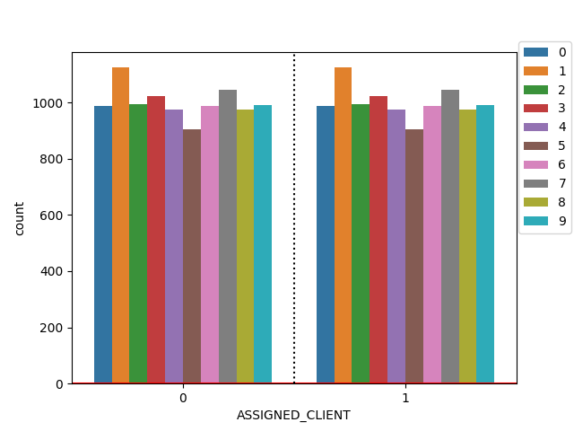
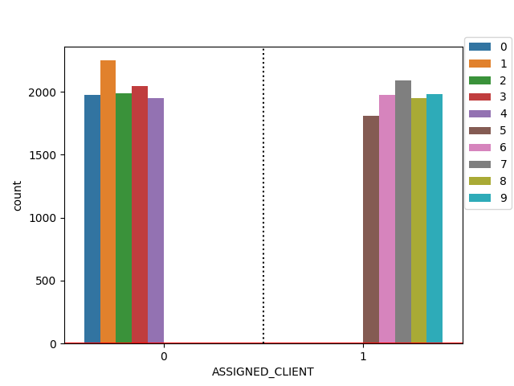
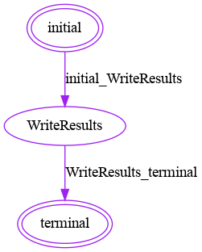

# FeatureCloud Data Distributor app
### Easy experiment with FeatureCloud platform
Using the Data Distributor app, users can experiment with different FeatureCloud applications
just by sharing tokens. Usually, FeatureCloud participants, both coordinator and clients, need to 
have their own private data and globally shared config file to conduct an experiment in a federated fashion with the FeatureCloud platform; however, with the Data Distributor app, only the coordinator should 
upload a centralized data and config file to start a workflow, while other clients can join by invitation
token.
The data distributor provides an easy way to distribute centralized data across clients with different levels of data heterogeneity.
DataDistributor supports IID (Independent and Identically Distributed) and Non-IID sampling.
Currently, the data distributor app can independently and identically distribute the data regardless of the number of class labels once the data includes discrete and finite target values, e.g., classification. In the Data set, each sample should consist of an arbitrary number of features
and a single class label from a finite discrete set of labels.
In NonIID sampling of data, an arbitrary number of clients and class labels are supported to simulate different levels of data heterogeneity across clients. The number of clients that have access to samples of a specific class label can be arbitrary, while Non-IID-ness of sampling lies in the number of clients that have access to samples from
each unique class label.

##### Input
Input data files should be in the same structure as what is expected for [CrossValidation](https://github.com/FeatureCloud/fc-cross-validation/tree/Numpy#input) app.  
   
##### Output
Output files will be with the same extensions as the input files. 

### Sampling

- IID: Balanced independent and identically distributed data for different clients.
- Non-IID: Different levels of data heterogeneity in terms of the number of clients that have access to samples from any unique class label.

#### IID (Independent and Identically Distributed)



#### Non-IID

Non-IID-ness can vary based on the number of clients that have access to a specific class label.
For instance, here, Non-IID(1) is plotted, where samples of each class label can be found in local data of one client(No more clients will get such samples). If there are fewer clients
than the level of Non-IID-ness, fewer clients may get samples of a specific class. In that regard,
Non-IID-ness is an upper bound of label availability.



### Workflows
DataDistributor loads and distributes centralized data at one of the clients and then broadcasts clients' data to them.
Each client stores its data locally that can be used in future experiments with FeatureCloud applications.
- DataDistributor should be used as the first application in a workflow; however, practitioners and researchers may employ
    it on previously processed data in the FeatureCloud platform. 
- Post: Various chains of applications can be used after the data distributor app (e.g., Image normalization, Cross-Validation, and/or Deep Learning)



### Config
Following config information should be included in the `config.yml` to run the DataDistributor app in a workflow:
```angular2html
fc_data_distributor:
  local_dataset:
    data: data.csv
    task: classification
    target_value: '10'
    sep: ','
  sampling:
    type: Non-IID
    non_iid_ness: 1
  result:
    data: data.csv
```
#### Config file options:
In the config file, `local_dataset` is very similar to the [corss validation](https://github.com/FeatureCloud/fc-cross-validation/tree/Numpy#input).
- local_dataset: Includes the name of the data file, the target task that data should be preprocessed for, and the target value file or column. Also, for CSV files, it is possible to determine the delimiter. 
  The config files include the name of the centralized data, which can have different extensions.
  - Data extension: data file can be three formats of `.txt`, `.csv`, and `.npy` 
    - `.npz`: NpmPy compressed files are supposed to have `data` and `targets` keys for samples and target values.
    - `.npy`: NumPy files are supported, which can be used with the Deep Learning app (and its companion apps).
      for the NumPy file, the target value(Label) can be placed at a separate Numpy array or the end of the sample
      array.
    - `.csv`: These files can be used with different separators, while the name of the label column should be provided.
      Indexes will be ignored and not being added to the result file.
    - `.txt`: Same as `.csv` files. 
  - Task: The task that the centralized data should be distributed for. 
    The task name is not case-sensitive and can be:
      - 'Classification'
      - 'Regression'
      - 'Clustering' 
  - Target Value: For CSV and TXT files, conveniently, target values are in a column; however,
      For instance, there are no target values for Clustering data and provided target value option will be ignored. For NumPy files, it can be either in the same or separate file.  
    - CSV: the target value config option is the column's name that contains the target value.
    - TXT: Same as CSV.
    - NumPy: for NumPy files, there are three available options:
      - Inside: the target value should be in the same file as features.
        - `same-sep`: In the same file as features, but a separate array.
        - `same-last`: In the same file and at the end of each sample's features array.
      - Outside:
        - name: Name the file of target values. 
          Both feature and target value files should have the same number of items with the same order of appearances.
- Sampling: Includes sampling type and the level of data heterogeneity.
  - Type: Sampling type options are two, and neither are case-sensitive:
    - `IID`
    - `Non-IID`: Currently, only classification data are supported!
  - Non-IID-ness: The level on Non-IID-ness can vary between 1 and the number of labels;
  And it will be ignored for IID sampling.
- results:
  - data: data file name. In case of `npz` files, the same data and target keys will be used to store data and target values.

